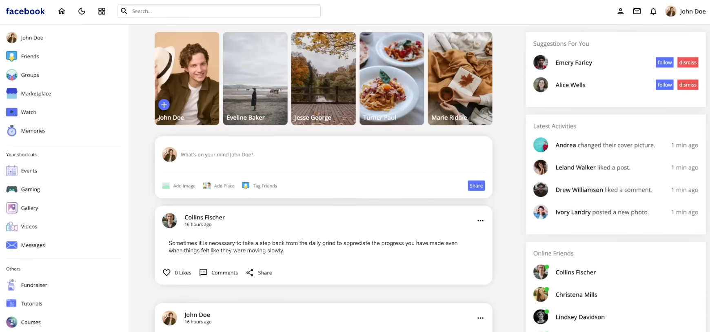
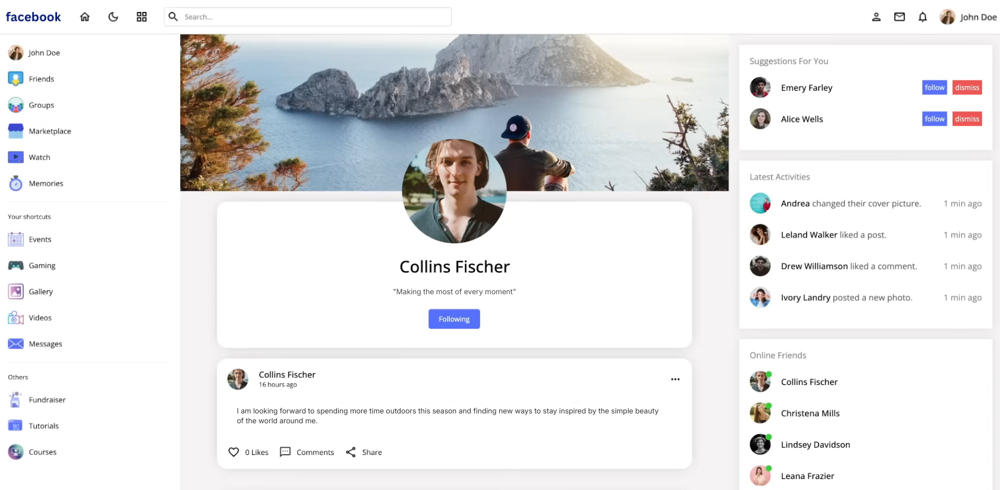

# Social Media Platform

A full-stack social network platform built with React, Node.js, and MySQL. The application features user authentication, posting, commenting, likes/dislikes, and follow/unfollow functionality, with efficient state management using React hooks, Context API, and React Query.

---

## Project Images

<h3>&emsp;&emsp;&emsp;&emsp;&emsp;&emsp;&emsp;&emsp;&emsp;&emsp;&emsp;&emsp;&emsp;&emsp;&emsp;&nbsp;&nbsp;&nbsp;&nbsp;Home Page</h3>


<br>

<h3>&emsp;&emsp;&emsp;&emsp;&emsp;&emsp;&emsp;&emsp;&emsp;&emsp;&emsp;&emsp;&emsp;&emsp;&emsp;&nbsp;&nbsp;&nbsp;&nbsp;Profile Page</h3>


---


## Technologies

```React.js```  ```Node.js```  ```MySQL```  

---

## Features

- MySQL database to manage users, posts, comments, likes, and follower/following relationships  
- REST API built with Node.js for authentication, posts, comments, and user interactions  
- Secure authentication using JWT tokens stored in cookies  
- React frontend with hooks and Context API for global state management  
- React Query for efficient server data fetching, caching, and mutations  
- Create, update, and delete posts, including file/image uploads  
- Like/dislike posts, comment, and follow/unfollow other users dynamically  
- User profile with editable information  
- Fully responsive layouts for seamless experience on all devices  
- File and media uploads handled through React components  

---

## Running the Project

1. Clone the repository:
   ```bash
   git clone https://github.com/ssharpalla2002/Social_Media_Platform.git
   ```

2. Install backend dependencies and run the server:
   ```bash
   cd api
   npm install
   npm run dev
   ```

3. Install frontend dependencies and run the client:
   ```bash
   cd client
   npm install
   npm start
   ```

4. Open the application in your browser:
   ```
   http://localhost:3000
   ```
